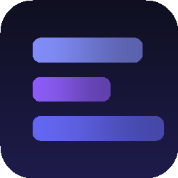

# DevDash

A solo-developer dashboard for Windows that combines a **local project dashboard** and a **deploy radar** into a single Electron app. Track git status, spawn dev servers, and watch Vercel/Render deploys from one window.



## Features

### Projects tab
For each registered project, a card shows:
- **Git status**: branch, ahead/behind origin, dirty/clean indicator, modified/staged/untracked counts
- **Last commit**: short hash, message, author, relative time
- **Dev server**: auto-detected port from `vite.config.*` or `package.json` scripts
- **Quick actions**: open folder, open in VS Code, open GitHub, open live URL, run dev (spawns a detached PowerShell window), git pull

Pre-seeded with 5 projects on first launch. New projects are added via the **+ Add project** button with a form (name, path with folder picker, GitHub URL, live URL, deploy provider + ID).

### Deploys tab (Deploy Radar)
- Lists recent deployments from projects with a Vercel or Render provider configured
- Status badges: Ready / Building / Error / Queued / Canceled
- Auto-polls every 5 minutes (configurable, 1–120)
- Toast + OS notification on state transitions (`building → ready`, `* → error`)
- Filter chips: All / Ready / Building / Error
- Direct links to provider dashboard and preview URL

### Settings tab
- Vercel & Render API tokens (password fields with show/hide)
- Poll interval
- Dark mode toggle (currently dark-only; kept for future light theme)
- Auto-launch on Windows startup
- About section with version, config path, and open-logs button

## Install

### Grab the installer
1. Download `DevDash-Setup-0.1.0.exe` from the [Releases](https://github.com/Vexccz/devdash/releases) page.
2. Run the installer (NSIS, per-user, no admin needed).
3. Launch DevDash from the Start menu or desktop shortcut.

### From source

```powershell
git clone https://github.com/Vexccz/devdash.git
Set-Location devdash
npm install
npm run dev       # runs Vite + Electron
npm run dist      # builds dist/DevDash-Setup-0.1.0.exe
```

Node 22+ recommended. The first `npm install` triggers `electron-builder install-app-deps` which rebuilds `better-sqlite3` for the Electron ABI.

## API token setup

### Vercel
1. Go to [vercel.com/account/tokens](https://vercel.com/account/tokens).
2. Create a token scoped to your projects (read access is enough).
3. Paste into Settings → Vercel API token.
4. For each project, open the project in Vercel, copy the **Project ID** from the settings page, and paste it into the project's **Project ID** field in DevDash.

### Render
1. Go to [dashboard.render.com/u/account/api-keys](https://dashboard.render.com/u/account/api-keys).
2. Create an API key.
3. Paste into Settings → Render API token.
4. For each Render service, copy the **Service ID** (`srv_xxx`, visible in the service URL) and paste it into the project's **Service ID** field in DevDash.

## Storage locations

- Config (projects + settings): `%APPDATA%\devdash\config.json`
- Deploy cache: `%APPDATA%\devdash\cache.db`
- Logs: `%APPDATA%\devdash\logs\`

## Tech stack

- Electron 32 + TypeScript
- React 18 + Vite 5
- Tailwind CSS 3 (indigo/violet palette)
- `simple-git` for git operations (status, log, fetch, pull)
- `better-sqlite3` for deploy history cache
- `axios` for Vercel/Render APIs
- `date-fns` for time formatting
- `electron-builder` NSIS installer
- Icons generated from `scripts/make-icons.cjs` with `pngjs`

## Design notes

- Dark theme with **indigo / violet** accent (`#6366f1`) so it visually differs from FocusJar (amber) and QuickClip (cyan).
- Custom borderless title bar with min/max/close buttons, draggable with `-webkit-app-region: drag`.
- 960x640 default window, resizable with 820x560 minimum.
- Tray icon + single-instance lock so relaunches just surface the existing window.
- Git `fetch()` is rate-limited to once every 2 minutes per project to avoid hammering remotes.

## File structure

```
devdash/
├─ electron/
│  ├─ main.ts           # IPC, windows, tray, polling loop
│  ├─ preload.ts        # contextBridge (window.devdash)
│  ├─ config.ts         # AppConfig, seed projects, persistence
│  ├─ git.ts            # simple-git wrappers, dev-server detection
│  ├─ deploys.ts        # Vercel / Render API clients
│  └─ cache.ts          # better-sqlite3 deploy cache
├─ src/
│  ├─ App.tsx
│  ├─ components/
│  │  ├─ TitleBar.tsx
│  │  ├─ Sidebar.tsx
│  │  ├─ ProjectsView.tsx + AddProjectModal.tsx
│  │  ├─ DeploysView.tsx
│  │  ├─ SettingsView.tsx
│  │  └─ Toasts.tsx
│  ├─ types.ts          # shared types + window.devdash declaration
│  └─ styles.css
├─ scripts/make-icons.cjs
└─ build/icon.png
```

## Scripts

| Command | What it does |
| --- | --- |
| `npm run dev` | Vite dev server + Electron with hot TS compile |
| `npm run build` | TS compile main + Vite build renderer |
| `npm run dist` | Full NSIS installer at `dist/DevDash-Setup-0.1.0.exe` |
| `npm run icons` | Regenerate tray + app icons |
| `npm run typecheck` | Strict type check both configs |
| `npm run rebuild` | Force rebuild native modules for Electron |

## Screenshots

_Add screenshots of Projects / Deploys / Settings tabs here after first run._

## License

MIT © Vexccz
